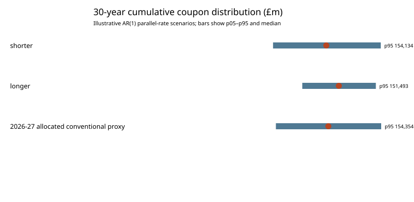

# UK sovereign debt strategy lab: policy brief

**30 September 2026 — independent educational analysis, not investment or policy advice.**

## Executive finding

The UK Debt Management Office's revised financing remit dated 23 April 2026 planned a **£251.2bn Net Financing Requirement**, met by **£246.2bn gilt sales** and a **£5.0bn net Treasury bill contribution**. Planned gilt sales comprised £95.0bn short conventional, £76.0bn medium conventional (including green), £22.4bn long conventional, £23.0bn index-linked and £29.8bn initially unallocated. Auctions accounted for £174.4bn and planned syndications approximately £42.0bn. The unallocated portion is operational flexibility, not a maturity allocation. The source also said planned green gilt sales were £12.0bn. See the [official revision](https://www.dmo.gov.uk/media/ajmifgdv/pr230426_2.pdf).

Within the £193.4bn explicitly allocated conventional programme, the maturity mix was approximately **49.12% short, 39.30% medium and 11.58% long**. That observed plan cannot be declared “optimal” from the public tables alone: demand, market capacity, auction performance, liquidity, the existing portfolio and the wider financing arithmetic all matter.

## What the project now tests

The model makes a deliberately restricted experiment. It maps short, medium and long conventional sectors to illustrative 2-, 10- and 30-year tenors and applies invented starting yields of 4.00%, 4.30% and 4.70%. The mapping is a **proxy**, not a reconstruction of actual DMO operations: the DMO defines sectors as 0–7, 7–15 and over 15 years, so one tenor cannot represent every gilt in a sector.

A reproducible Monte Carlo model applies an annual parallel yield-curve shift following an AR(1) process. Each maturity bucket reprices only when it rolls over. Five thousand common random paths compare:

- a shorter illustrative mix (35% 2-year, 35% 5-year, 20% 10-year, 10% 30-year);
- a longer illustrative mix (10%, 20%, 30%, 40%);
- the allocated conventional remit proxy (49.12% 2-year, 39.30% 10-year, 11.58% 30-year).

Under the central *illustrative* assumptions—30 years, annual volatility of 100bp, persistence 0.75, zero long-run parallel shift and a zero yield floor—the results are:

| Strategy | Median cumulative coupons | 95th percentile | Upper-tail width (p95 − median) |
|---|---:|---:|---:|
| Shorter | £124.904bn | £154.134bn | £29.230bn |
| Longer | £131.629bn | £151.493bn | £19.864bn |
| 2026–27 allocated conventional proxy | £126.012bn | £154.354bn | £28.343bn |

The longer mix costs more at the median under the invented upward-sloping starting yields, but has a narrower upper tail because less principal reprices during the horizon. This is a model mechanism, not evidence that the DMO should issue more long debt.

## Robustness grid

The sensitivity analysis varies annual parallel-shift volatility across **50, 100 and 150bp** and persistence across **0.50, 0.75 and 0.90**, using 2,000 paths per cell. The p95 coupon cost varies widely: approximately £133.6bn–£210.2bn for the shorter mix, £138.3bn–£186.7bn for the longer mix and £134.6bn–£208.5bn for the remit proxy. Therefore, the numerical tail estimate is highly model-dependent.

The more limited qualitative result is steadier: longer fixed-rate debt reduces the frequency with which the model reprices principal, while its higher assumed starting yield raises baseline coupons. A real recommendation requires calibrated yield dynamics, present-value cost, actual gilt-level cash flows, investor demand and operational constraints.

## Decision framework

A credible sovereign-debt recommendation would not choose the lowest simulated coupon number mechanically. It would consider:

1. **Cost:** expected present value of interest and issuance proceeds, not undiscounted coupons alone.
2. **Refinancing risk:** the size and concentration of maturities under adverse yield and demand conditions.
3. **Market capacity and liquidity:** demand by sector, benchmark development and auction/syndication execution.
4. **Inflation exposure:** index-linked cash flows and the accounting treatment of inflation uplift.
5. **Operational flexibility:** the role of the initially unallocated portion, tenders, PAOF and in-year remit revisions.
6. **Robustness:** whether a strategy remains acceptable across plausible models rather than merely performing best in one.

## Next data work

The next credible upgrade is gilt-level calibration: ingest the DMO D1A stock table, actual auction/syndication outcomes and a dated Bank of England nominal yield curve. That would permit cash-flow pricing, duration/DV01, issue-price effects and reconciliation between gross nominal gilts in issue and D8B market-hands redemptions. Until then, the project is best presented as a transparent **decision laboratory**, not an estimate of official financing costs.
