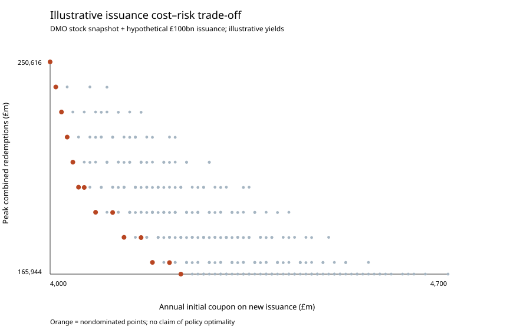
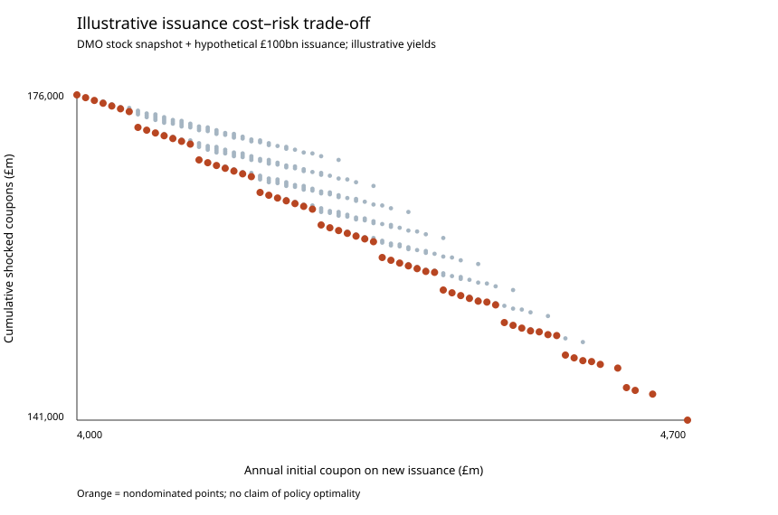

# UK gilt redemptions and illustrative issuance choices

**Research note, 21 September 2026.** Independent analysis; not a DMO forecast or recommendation.

## Question and source

How does the maturity mix of a hypothetical £100bn conventional gilt issue alter (a) its initial annual coupon cost, (b) concentrations in an existing redemption profile, and (c) coupon exposure when refinancing rates rise at rollover?

The baseline is a transcription of the UK Debt Management Office's [Future Redemptions report (D8B)](https://www.dmo.gov.uk/umbraco/surface/PDFReport/GetDataExport?reportCode=D8B), dated **21 September 2026**. It lists 47 financial years from 2027-28 to 2073-74. The report says its figures are net of government holdings, notes that holdings are updated after month-end, and explains a special treatment of inflation uplift on index-linked redemptions. Its numbers will change when gilts are issued or bought back. The first year shown is 2027-28, so this exercise makes no claim about 2026-27 redemptions.

Source attribution and reuse terms appear in [`data/SOURCE.md`](../data/SOURCE.md). Contains public sector information licensed under the Open Government Licence v3.0.

The DMO describes its debt management remit as minimising long-term financing costs while taking account of risk. HM Treasury sets the annual financing remit, including the split between conventional and index-linked issuance and conventional maturities. This exercise tests a narrow cost and redemption-concentration proxy within that wider decision. See [DMO remit](https://www.dmo.gov.uk/about/who-we-are/) and [financing remit](https://www.dmo.gov.uk/responsibilities/financing-remit/).

## Observed baseline

| Measure across listed D8B years | Value |
|---|---:|
| Scheduled redemptions | £2,407.274bn |
| Index-linked component | 18.92% |
| Largest year | 2029-30: £165.944bn |
| First five listed years | £743.802bn (30.90% of listed total) |

These sums describe the published snapshot, not the public sector's total debt or financing requirement. The original [stacked maturity chart](dmo_redemptions_2026-09-21.svg) and [calculation summary](dmo_redemptions_2026-09-21_summary.json) are available in this folder.

## Experimental design

1. Issue **£100bn** of hypothetical conventional gilts during financial year 2026-27. Choose shares in 2, 5, 10 and 30 year maturities, in 10 percentage point steps, summing to 100%. This yields **286** allocations.
2. Use explicitly *illustrative* par yields of **4.00%, 4.10%, 4.30% and 4.70%**, respectively. These are invented teaching inputs; they are not a yield curve for 21 September 2026. Initial annual coupon is issue amount multiplied by the share-weighted yield.
3. Assume original principal matures in financial year `2026 + tenor` and add it to the corresponding D8B stock entry. The ten-year concentration metric is the maximum combined redemption in 2027-28 through 2036-37. No forecast of future stock changes, future issuance, government holdings or cash borrowing is made.
4. For a simplified refinancing sensitivity, roll principal into the same tenor after each maturity. At each first rollover, its annual coupon yield becomes the original assumed yield **plus 200 basis points**, and stays there. Coupons are annual; there is no discounting, issuance premium, principal repayment cost or reinvestment assumption. The 30-year scenario counts coupons through year 30, including the original coupon in its maturity year.
5. A point lies on the displayed frontier when no other grid allocation has both a lower initial coupon *and* a lower selected risk measure. This is mathematical nondominance within the **chosen grid and assumptions**, not an estimate of optimal government issuance.

## Results: ten-year redemption concentration

| Illustrative choice (2y / 5y / 10y / 30y) | Initial coupon per year | Peak combined redemptions in ten years | Ten-year coupons with +200bp rollover |
|---|---:|---:|---:|
| 100% / 0% / 0% / 0% | £4.000bn | £250.616bn (2028-29) | £56.000bn |
| 50% / 50% / 0% / 0% | £4.050bn | £200.616bn (2028-29) | £53.500bn |
| 10% / 20% / 70% / 0% | £4.230bn | £165.944bn (2029-30) | £45.900bn |

Fourteen of the 286 allocations lie on the initial-coupon versus peak-redemption frontier. The last displayed allocation reaches the **pre-existing 2029-30 peak** without increasing it. Within this ten-year metric and assumed yield ordering, 30-year issuance adds initial coupon expense but does not further lower that peak; this reflects the metric and horizon rather than a judgement about long gilts.



## Horizon sensitivity: thirty-year shocked coupons

Changing the vertical measure to cumulative coupons over **30 years** under the specified +200bp rollover shock changes the comparison. The 100% 2-year allocation has £4.000bn initial annual coupons and £176.000bn cumulative shocked coupons; 100% 30-year has £4.700bn and £141.000bn. The 30-year gilt does not reprice during the coupon observation window. Across the same 286 candidates, 66 allocations are nondominated on those two measures. The number of frontier points depends on the grid step and excludes all untested continuous allocations.



The trade-off is *conditional*: a larger or smaller rollover shock, a different yield curve, a shorter window, issuance discounts or a present-value measure can change it. A cumulative coupon total is not a net-present-value measure of public financing cost. The stock baseline is relevant to redemption concentration but is **not** priced into the hypothetical coupon totals.

## Reproduce

From the repository root, using Python 3.10+ and no third-party packages:

```bash
python -m unittest discover -s tests -v
python d8b_analysis.py data/dmo_d8b_2026-09-21.csv --output outputs
python strategy_frontier.py data/dmo_d8b_2026-09-21.csv examples/illustrative_yields.csv --output outputs/ten_year
python strategy_frontier.py data/dmo_d8b_2026-09-21.csv examples/illustrative_yields.csv --horizon 30 --risk-metric shock_cost --output outputs/thirty_year
```

Each run writes a full 286-row `strategy_grid.csv`, a chart and a JSON file containing assumptions and the nondominated allocations. The original two named mixes can be explored with `issuance_scenarios.py`.

## Research limits and next investigations

- Verify a same-date DMO **Gilts in Issue (D1A)** export and reconcile gross nominal maturity totals with D8B's market-hands values, separately for conventional and index-linked gilts. D8B's index-linked amounts require care because inflation uplift is split in the financing accounting.
- Replace invented par yields with a dated, documented market data series. Bond yields are not automatically coupon rates or proceeds: price, coupon, accrued interest and maturity matter. For an actual issuance model, incorporate auction proceeds and the cash requirement.
- Extend beyond a fixed +200bp rollover shock: a range of yield paths, discounting, investor demand, liquidity, index-linked cash flows and sensitivity to the government's published financing remit. Consider scenarios, not an unsupported probability-weighted forecast.
- Compare issuance amounts with practical auction and syndication capacity. The DMO's objective and HM Treasury's remit involve more than this two-variable toy frontier.
